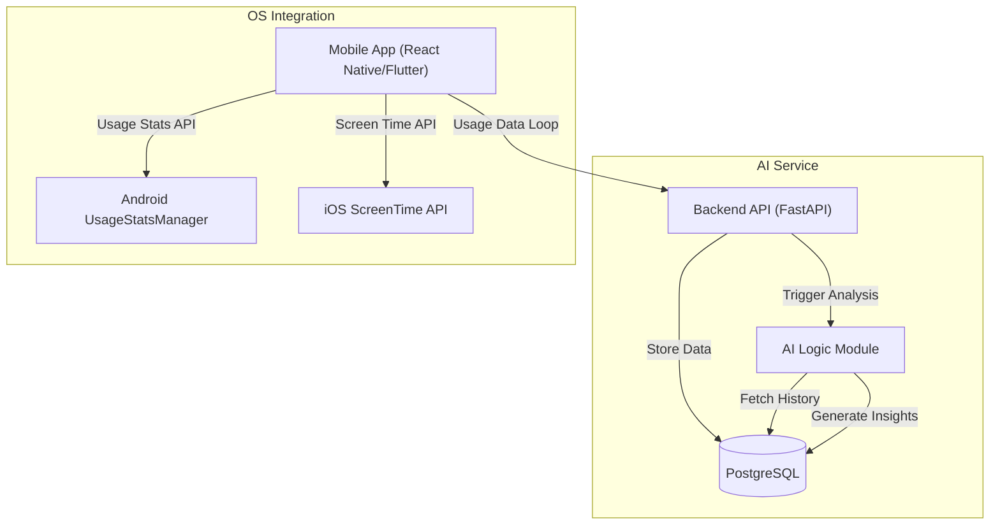
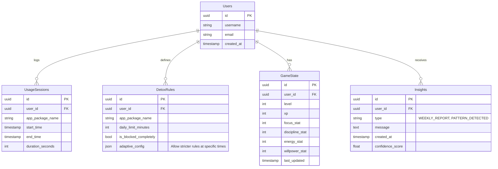

# Idle Hero: Digital Detox RPG

A mobile-first application that gamifies digital detox by rewarding users for reducing screen time on specific apps. Progress your RPG character by building discipline in the real world.

## Core Product Goal
Help users reduce compulsive social media usage through behavioral feedback, adaptive difficulty, and game-based rewards.
**Philosophy:** Realistic, minimal, and non-intrusive.

---

## 1. High-Level System Architecture

The system follows a standard client-server architecture with an asynchronous AI processing pipeline.

### Components
1.  **Mobile Client**:
    *   **Tech**: React Native or Flutter.
    *   **Role**: Collects usage data, displays RPG stats, enforces "soft" blocks (overlays), handles offline syncing.
    *   **OS Integration**: Background services to poll app usage (Android `UsageStatsManager`, iOS `ScreenTime`).
2.  **Backend API**:
    *   **Tech**: Python (FastAPI).
    *   **Role**: RESTful interface for user data, sync usage logs, manage game state, validte rewards.
3.  **Database**:
    *   **Tech**: PostgreSQL.
    *   **Role**: Relational storage for users, sessions, detox rules, and game state.
4.  **AI Engine**:
    *   **Tech**: Python (pandas/scikit-learn + LLM integration).
    *   **Role**: Batch processing of usage logs to detect patterns and generate text insights.

---

## 2. Database Schema

---

## 3. Core Backend API Endpoints (REST)

### User Management
*   `POST /auth/register`: Create account.
*   `POST /auth/login`: Authenticate & get JWT.

### Data Synchronization
*   `POST /sync/usage`: Upload batch of local app usage logs.
    *   *Input*: List of `{package_name, start, end}`.
    *   *Output*: Acknowledgement, current game state drift.

### Detox Rules
*   `GET /rules`: Fetch current active rules.
*   `POST /rules`: Create/Update a detox rule (e.g., limit TikTok to 30m).

### Game Interface
*   `GET /game/status`: Get current stats (Level, XP, Stats).
*   `POST /game/claim-reward`: Claim daily streak or milestone rewards.

### AI Insights
*   `GET /insights/daily`: Fetch generated behavioral insights for the dashboard.

---

## 4. AI Pipeline

**Inputs**:
*   Raw usage logs (Last 7 days).
*   Current Detox Rules.
*   User Game Stats.

**Processing Steps**:
1.  **Normalization**: Aggregate usage by hour of day (0-23) and app category.
2.  **Pattern Detection**:
    *   Calculate `Relapse Probability` per hour (e.g., High usage between 22:00-24:00).
    *   Cluster user into "Archetypes" (e.g., "Night Scroller", "Morning Checker").
3.  **Insight Generation (LLM)**:
    *   *Prompt*: "User spent 3h on Instagram yesterday, mostly 11pm-1am. Be factual. No fluff."
    *   *Output*: "You used Instagram for 3 hours yesterday. 80% of this was after 11 PM, affecting your sleep schedule."
4.  **Adaptive Difficulty**:
    *   If `success_rate > 90%` for 3 days -> Suggest tightening limit by 5 minutes.
    *   If `success_rate < 50%` -> Suggest loosening limit to build momentum.

**Outputs**:
*   `InsightObject`: Text message + data highlight.
*   `RuleAdjustmentCorrection`: Recommended rule change.

---

## 5. Game Logic Flow (MVP)

**1. Stats System**
*   **Focus**: Gained by long periods without opening tracked apps.
*   **Discipline**: Gained by sticking to strict blocks.
*   **Energy**: Regenerates daily; consumed by "relapses" (breaking a rule).
*   **XP**: `(Focus + Discipline) * Multiplier`.

**2. The "Detox Loop"**
*   **Daily Check-in**: User opens app -> Syncs usage data from OS.
*   **Evaluation**:
    *   Did user stay under limits yesterday? -> **Reward**: +100 XP, +5 Discipline.
    *   Did user exceed limits? -> **Penalty**: -10 Energy, 0 XP.
*   **Level Up**: XP threshold reached -> Unlock cosmetic item (e.g., new avatar background).

**3. Penalties**
*   **Energy Drain**: Breaking a rule drains Energy.
*   **Burnout**: If Energy hits 0, XP gain is frozen for 24 hours.

---

## 6. Strict MVP Feature List

1.  **Onboarding**: Permission grant (Usage Stats), Select 3 "Problem Apps".
2.  **Dashboard**:
    *   Character View (Simple static avatar + Stat bars).
    *   Today's Usage vs. Limit Graph.
3.  **Usage Tracking Service**: Background job to poll specific package names.
4.  **Rules Engine**: Simple "Max N minutes per day" logic.
5.  **Manual Sync**: Button to force "Check my progress" (simplifies background sync complexity).
6.  **AI Insight Card**: One daily generated text tip on the home screen.
7.  **Profile**: View Level and basic history.

**Excluded from MVP**:
*   Social/Friends.
*   Inventory/Items (Stats only).
*   Combat/Quests.
*   In-app purchases.

---

## 7. Development Plan (2 Weeks)

### Week 1: Foundation & Tracking
*   **Day 1-2**: Project Setup (RN/FastAPI). Set up PostgreSQL. Implement Auth.
*   **Day 3-4**: Build Native Modules for `UsageStats` (Android) / `ScreenTime` (iOS - Mock if needed for strict timeline).
*   **Day 5**: Implement data sync API and database storage for sessions.
*   **Day 6-7**: Build basic React Native UI (Dashboard, Permissions). **Milestone**: App shows real-time usage of TikTok/Instagram.

### Week 2: Game Logic & AI
*   **Day 8**: Implement Rule evaluation logic (Server-side).
*   **Day 9**: Build the RPG Stat System (Database tables, API response).
*   **Day 10**: Integrate basic Scripts/LLM for "Daily Insight" generation.
*   **Day 11**: Connect Game Logic to UI (Show XP bar growing).
*   **Day 12**: Polish & "Juice" (Animations for leveling up, simple sound effects).
*   **Day 13-14**: QA, Bug fixes, and README documentation.

